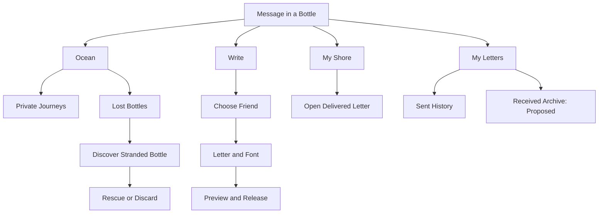
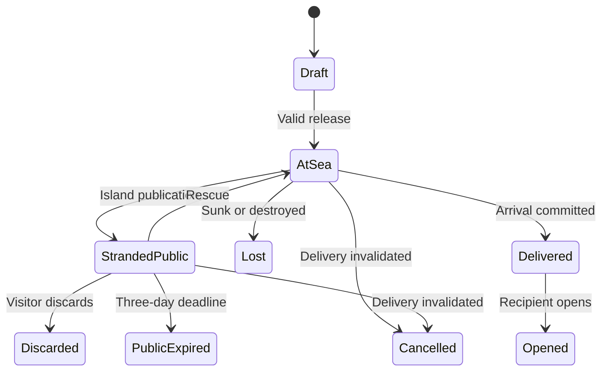
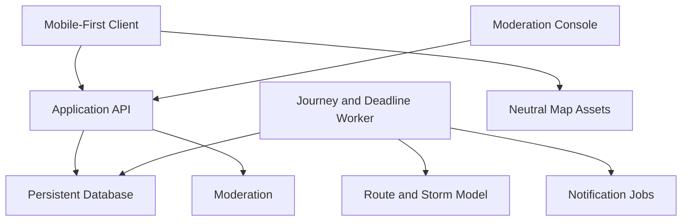

# Message in a Bottle

## Product Specification — v0.2

Date: 5 September 2026  
Status: Revised product baseline; open decisions remain. Not an implementation authorization.  
Supersedes: v0.1 discussion draft  
Working name: Message in bottle

## 1. Vision and decision authority

Write to someone you know. Seal the letter in a bottle, throw it into the ocean, and watch its uncertain journey toward their shore.

Message in a Bottle is a slow correspondence experience between friends. The sender chooses the recipient; the sea determines whether the bottle arrives safely, becomes stranded and publicly discoverable, or is permanently lost. The recipient does not see the incoming journey before arrival. Anticipation, surprise, aging paper, and the possibility of rescue are the experience—not obstacles to an instant chat.

This revision incorporates the user's product changes and typography clarification. It replaces random-recipient delivery and the recipient's keep-or-rerelease loop throughout the specification.

### How to read this document

- **Confirmed:** explicitly requested by the user, including the current request to update the specification.
- **Proposed:** a design, engineering, or safety recommendation; not an independently approved product rule.
- **Open:** a choice still requiring confirmation. Suggestions from earlier assistant responses are not automatically treated as accepted.

Detailed engineering mechanisms below are proposed implementation requirements, not an approved technology stack. No application code has been started as part of this revision.

## 2. Confirmed product baseline

| Area | Confirmed direction |
| --- | --- |
| Recipient | Sender chooses a friend; no self-delivery. |
| Repeat correspondence | Multiple bottles may be sent to the same recipient, subject to shore capacity. |
| Blocking | A recipient must not receive bottles from a sender they blocked. |
| Shore | Manual selection or optional GPS-assisted coastal assignment; inland users can participate. |
| Geography | No countries marked on the map; use a nonpolitical geographic presentation. |
| Route | Predefined connected sea routes, with a dashed route toward the destination. |
| Tracking | Sender sees current simulated bottle position and elapsed time since release. |
| Surprise | Recipient does not see an incoming bottle before arrival. |
| Private map | Sender sees their outgoing bottles, without user-location markers. |
| Public map | Island-stranded bottles become discoverable; others can read, rescue, or discard them. |
| Public duration | A bottle disappears from the public space after three days. Its subsequent fate remains open. |
| Risk | Storms can increase stranding risk; bottles can sink or be destroyed. |
| Failure feedback | Sender receives journey-event notifications and distinct stranded/lost markers. |
| Text | Maximum 1,000 characters; content cannot change after release. |
| Typography | Visual fonts only; no AI, rewriting, or modification of wording. |
| Readability | Sender and recipient can switch the same text to readable print. |
| Aging | Paper becomes yellowed and slightly torn during travel. |
| Unopened letters | Notify the sender after a configurable unread interval. |
| Successful opening | Ends the journey; no recipient keep-versus-rerelease decision. |
| Metadata | Release date, origin shore, sender, and recipient accompany the private bottle record. |

## 3. Audience and experience principles

Audience hypothesis: people who enjoy meaningful, playful correspondence with friends and occasional discovery of stranded letters. Proposed initial audience: adults, with age policy and safeguarding requirements reviewed before launch.

| Principle | Consequence |
| --- | --- |
| Destination is personal | A specific friend is selected before release. |
| Arrival is uncertain | Do not promise guaranteed delivery or suitability for urgent communication. |
| The journey is visible | Show coherent sea movement, elapsed time, weather, and milestones. |
| Arrival is a surprise | No incoming-route data or prearrival alerts for the recipient. |
| Exposure is explicit | Explain that stranded letters may become readable by strangers. |
| Words remain authentic | Fonts and aging affect presentation only. |
| Geography is virtual | A shore is an app anchor, not evidence of residence or physical travel. |
| Accessibility is essential | Readable print, text status, list views, and reduced motion remain available. |

Proposed: avoid streak penalties, leaderboards, fake human activity, and pay-to-bypass safety rules.

## 4. Feature and navigation map

Proposed mobile navigation: Ocean, Write, My Shore, and My Letters. Ocean contains clearly separated Private Journeys and Lost Bottles modes. Friends, notifications, and settings are secondary destinations.

Settings include shore selection, language, font accessibility, sound, reduced motion, notifications, blocked users, and account deletion. A friends area handles discovery and requests; the exact identity lookup mechanism remains open.

## 5. End-to-end user journeys

### 5.1 Sending to a friend

1. Sign in and confirm a virtual shore.
2. Select a recipient from the friends list.
3. Write up to 1,000 characters and choose a visual font.
4. Preview the letter, sender/recipient labels, and proposed sea route.
5. Acknowledge that the letter may be publicly discovered, discarded, or lost; do not include sensitive or urgent information.
6. Confirm release. The server checks friendship eligibility, blocking, capacity, route availability, and content restrictions.
7. After successful commitment, the bottle launches and appears on the sender's private map.
8. The sender follows its route and receives event notifications. The recipient sees nothing before arrival.

### 5.2 Receiving

1. The server commits arrival at the recipient's virtual shore.
2. The bottle appears in My Shore and an arrival notification is created.
3. The recipient opens the bottle and reads the aged letter; readable print is available.
4. Opening completes the journey. There is no onward-sharing decision or appended-note feature.
5. Proposed: the empty bottle is visually recycled and the letter enters a private received archive. Archive retention and the exact end animation require confirmation.

If unopened for the chosen interval, the sender receives an unread notice. This notice alone does not delete, reroute, or publish the bottle. Unopened expiration is a separate open decision.

### 5.3 Public discovery

1. A bottle strands at an island reachable from its current sea route.
2. It becomes available on the Lost Bottles map for three days, subject to safety restrictions.
3. An eligible visitor may open and read it, rescue it toward the original recipient, or discard it permanently.
4. Rescue preserves the original letter, sender, recipient, and release timestamp. Visitors cannot edit, add notes, or choose a new destination.
5. Discarding ends delivery; the sender receives a failure event.
6. At three days, public access expires even if no visitor has acted. The subsequent journey outcome is not yet approved.

## 6. Shore assignment and nonpolitical geography

### 6.1 Shore selection

Confirmed: users may choose a shore or use GPS-assisted assignment, including people living away from the sea.

Proposed implementation:

- Suggest the nearest supported coastal anchor connected to the app's maritime network, based on coordinates rather than nationality.
- Let the user confirm or override the suggestion. Without location permission, show the same manual picker.
- Calculate on-device where practical. If server processing is necessary, discard precise coordinates after resolving the shore; do not put them in analytics or logs.
- Store the virtual shore identifier, not continuous GPS location.
- Explain that assignment does not establish residence, nationality, or physical proximity to another person.

The exact meaning of “nearest” and the supported shore catalog remain open. Do not encode a mandatory country-to-neighbor-country mapping. Proposed: shore changes affect future sends only; already-released bottles retain their origin and destination snapshots.

### 6.2 Geographic presentation

- Show recognizable land masses, coastlines, seas, oceans, islands, and virtual shores.
- Do not show country names, borders, flags, or political territory labels.
- Apply this policy to base-map tiles, zoom levels, search suggestions, legends, and accessibility labels—not just custom overlays.
- Proposed: use neutral or fictional shore names, with a naming review before launch. Omitting borders cannot guarantee that every geographic name is perceived as neutral.
- No user-location dots or GPS tracks appear on either map.

### 6.3 Connected maritime routing

Model supported water paths as a versioned graph of shore anchors, sea waypoints, island access points, and permitted passages. Edges must connect navigable virtual water paths. A bottle cannot cross land, jump between disconnected water bodies, or strand on an unreachable island.

Only supported connected shores can be selected. If no route exists, block release with a clear explanation; never fabricate a direct line. Decide explicitly which canals or passages are included. Same-shore sends need an approved local sea-loop or minimum-duration rule rather than an instantaneous arrival.

The sender sees a dashed planned route to the chosen destination and a visually distinct completed trail. Storm deviations and rescues may produce a revised connected plan. Keep prior route versions in history. Handle date-line crossings and map wrapping correctly.

Travel is a simulation, not a claim of live current prediction. The duration model, speed, and minimum/maximum times remain open; v0.1's 1–7-day proposal is not a confirmed rule.

## 7. Map visibility and authorization

“Real time” means the current server-derived simulated position, not a physical bottle or user location. Display elapsed time from initial release, including stranding; proposed: freeze total duration at a terminal outcome. Show the last synchronization time while offline rather than presenting stale state as live.

| Viewer | Private journey before arrival | Delivered letter | Stranded public bottle |
| --- | --- | --- | --- |
| Sender | Own route, position, elapsed time, events | Own sent record; read receipt is open | Noninteractive private marker stating transfer to public map |
| Intended recipient | No route, bottle record, or incoming notification | May open after committed arrival | Proposed: exclude discovery access before arrival to preserve surprise |
| Unrelated eligible visitor | No access | No access | May read, rescue, or discard while publication is active |
| Authorized moderator | Audited access for safety cases | Audited access for safety cases | Review and restrict access |

Proposed public projection: show text, origin shore, release date, and age; omit recipient identity, destination shore, private route, and internal account identifiers. Sender attribution is open; use anonymous attribution until approved. User-entered names or identifying text inside the letter can still reveal people—hiding metadata does not make the content anonymous.

The sender's stranded marker remains nonclickable as requested. Whether the sender may independently find and rescue their own bottle through the public map is open. Proposed: exclude both original participants from public interactions; otherwise the sender can trivially undo stranding and the recipient may discover a supposedly hidden incoming letter.

Public access does not grant future tracking rights after rescue. Enforce visibility on the server and in notifications, search, caches, and historical endpoints. Knowing a bottle ID is not authorization.

## 8. Friends, blocking, and shore capacity

### 8.1 Friendship

Confirmed: correspondence uses a friends list and supports repeated bottles between the same two people. No language-based random matching, unique-recipient rule, or one-new-bottle-per-day product limit remains.

Proposed: mutual friend-request approval, exact username or invitation-link discovery, request rate limits, and no exposure of phone numbers or email addresses. Interface language may be configured independently of the language of a friend's letter.

### 8.2 Blocking and eligibility changes

Check eligibility at release, rescue, and arrival. A blocked sender must never bypass the block through a stranded bottle or public lookup.

Proposed: if blocking or account restrictions invalidate an in-flight delivery, cancel it with a generic “Delivery unavailable” status. Do not notify the sender that they were blocked and do not publish the bottle as a fallback. Remove any active public listing. Exact behavior for unfriending alone, account deletion, and already-delivered unread letters requires confirmation. Safety restrictions take precedence over the journey fiction.

### 8.3 Capacity

Confirmed: the destination shore must have space; multiple bottles from the same sender are permitted.

Proposed reservation model:

- Reserve one destination slot atomically with release.
- Retain it during travel and stranding, including rescue; rescue must not allocate a second slot.
- A delivered unopened bottle still occupies its slot.
- Release the slot exactly once on opening or a terminal failure/cancellation.
- Reducing capacity does not evict accepted bottles; new releases wait until capacity is available.
- On full capacity, reject the new release and preserve the draft. Do not create an undisclosed delivery queue.

Capacity value, sender-specific limits, and reservation behavior need approval. Technical anti-spam rate limits remain necessary and must not be confused with a new daily product quota.

## 9. Storms, loss, and public expiry

The sea is normally calm. Storms have a defined region and time interval. Exposure can raise the probability of island stranding; sinking or destruction are supported permanent failures. Exact probabilities, whether loss can occur in calm water, and how storms alter speed remain open.

Proposed: use simulated weather for the first release, clearly labeled as part of the app. Do not imply real meteorological alerts or live ocean-current integration. Prefer rare permanent losses, but do not silently remove them from scope.

The server records each resolved exposure and outcome so refreshing the app or retrying a job cannot reroll fate. Exposure must be time-based, not dependent on how often a client polls. Storms stop affecting a bottle after arrival or terminal failure. Rescue resumes from the island, never from an arbitrary ocean position.

| Event | Sender feedback | Map consequence |
| --- | --- | --- |
| Storm exposure | Storm-risk alert | Weather overlay and text/icon status |
| Stranding | Notice that bottle moved to public map | Noninteractive stranded marker |
| Rescue | Notice that journey resumed | Active bottle and revised route |
| Visitor discard | Notice of ended journey | Terminal discard marker |
| Sinking/destruction | Notice of permanent loss | Red/X-style marker plus accessible text |
| Public expiry | Status event; exact copy depends on fate decision | Public listing removed |

### Three-day public window

Confirmed: the bottle disappears from the public map after three days. Proposed clock: 72 hours from publication, unaffected by reads. Validate deadline server-side on every read and action; do not depend on a cleanup job running on time.

Open: whether expiry ends the journey or automatically resumes it. The earlier suggestion of automatic resumption is a recommendation, not a confirmed decision. Until decided, model expiry explicitly and do not implement an implicit default. Repeated stranding and whether each incident receives a fresh window also need approval.

Public read access must end after rescue, discard, expiry, cancellation, or moderation restriction. This cannot retract screenshots or copies already made. Proposed: authenticated eligible visitors only, no public search-engine indexing, no retained copy for visitors. Concurrent visitors may read while available; only one valid rescue or discard can commit. Whether reading should temporarily reserve a bottle is open.

## 10. Letters, typography, aging, and metadata

### 10.1 Content and fonts

- Maximum letter length: 1,000 characters. Proposed technical definition: user-perceived Unicode characters, with matching client/server counting and a separate safe byte limit.
- Offer visual font choices such as handwriting, calligraphy, typewriter, and printed text.
- No AI generation, rewriting, translation, tone conversion, or Shakespearean wording transformation is included.
- Preview the actual wording in the selected font before sending.
- After release, the stored wording is immutable, including after rescue. No visitor or recipient may append a note.
- Proposed: lock the selected original font and sender/recipient metadata snapshots at release as well.
- Sender and recipient may toggle Readable Print without altering stored text or original appearance. Proposed: make it available to public readers too.
- Support line breaks, text selection where appropriate, screen readers, scalable text, RTL layout, and a fallback font for unsupported scripts. Review font licenses before distribution.

Safety removal/redaction is distinct from user editing: immutability must not prevent content withdrawal or moderation.

### 10.2 Visual aging

Confirmed: paper ages during travel and arrives somewhat yellowed and torn. Proposed: derive appearance from elapsed time, storm exposure, stranding, and rescue history. Store reproducible visual parameters; never randomly change the paper every time it opens.

Yellowing, wrinkles, stains, and edge tears are decorative layers. They must not erase letters, obscure content, or reduce contrast beyond readability. Readable Print provides a clean, accessible presentation of exactly the same text. Proposed: freeze the delivered appearance at arrival.

### 10.3 Private bottle passport

| Field | Meaning |
| --- | --- |
| Sender and recipient | Display names or pseudonyms; never imply verified legal identity |
| Release date/time | Original release timestamp, retained across rescues |
| Origin shore | Shore-name snapshot at release |
| Destination shore | Planned arrival anchor; private metadata |
| Elapsed duration | Time since original release; distinguish live and completed totals |
| Status | Traveling, storm-exposed, stranded, delivered, opened, or terminal outcome |
| Journey history | Route versions, storm events, stranding, rescue, arrival, failure |

Whether the recipient sees the completed route after arrival is open. The public projection is deliberately more limited than this private passport.

## 11. Lifecycle and concurrency model

The following model separates journey state from weather, moderation, and archive placement. This avoids treating a storm alert or a visual animation as an independent delivery state.

PublicExpired has no approved onward transition yet. Storm Risk is an exposure flag on AtSea; Rescued is an event transitioning back to AtSea; Completed is the journey outcome at opening, not a user choice. Archived is a proposed private storage/view property. Lost includes a reason distinguishing sinking and destruction.

| State | Allowed action | Deadline/terminal behavior |
| --- | --- | --- |
| Draft | Edit, preview, release | No live journey |
| AtSea | Sender follows; server advances | May arrive, strand, fail, or cancel |
| StrandedPublic | Eligible visitors read/rescue/discard | Public access ends at three-day deadline |
| PublicExpired | No public interaction | Fate must be resolved before implementation |
| Delivered | Intended recipient opens | Unread notice does not itself change state |
| Opened | Read again only if archive approved | Travel complete; no rerelease |
| Discarded/Lost/Cancelled | History only as permitted | No future delivery or rescue |

Moderation is an independent restriction: Clear, Quarantined, or Removed. Quarantine immediately denies reads and journey actions. Clearing must restore a compatible prior state, never resurrect a terminal bottle or reopen an expired publication. Proposed: public expiry uses wall-clock time even under quarantine; travel-time treatment during review remains open. Reports create cases, not automatic punishment from a single report.

Proposed reliability invariants:

1. Release commits the immutable letter, chosen recipient, route, capacity reservation, and first event together.
2. Rescue/discard/expiry compete against one state version and deadline; the first valid committed action wins.
3. Reading a public bottle does not complete delivery or produce a recipient-read receipt.
4. A block or moderation change is checked transactionally before arrival/rescue; stale UI cannot bypass it.
5. Retry keys prevent duplicate bottles, rescues, arrivals, slot releases, and notifications.
6. Terminal states cannot resume through delayed workers or old links.
7. Server time governs travel and deadlines; local device clocks cannot accelerate delivery.

## 12. Screens and required states

| Screen | Purpose | Required states |
| --- | --- | --- |
| Welcome and shore setup | Explain premise and choose anchor | Manual/GPS, permission denied, unsupported route, safety explanation |
| Friends | Select eligible recipients | Empty list, requests, pending/accepted, blocked/unavailable |
| Write and preview | Text, font, recipient, risk disclosure | Draft, 1,000-character limit, readable print, validation |
| Release scene | Seal, throw, splash | Submitting, confirmed, failed, reduced motion |
| Private Ocean | Track own sent bottles | Active route, stale/offline, storm, nonclickable stranded, terminal marker, list view |
| Lost Bottles | Public island discovery | Empty, available, expired, claimed by another action, restricted |
| Public letter | Read and decide | Readable print, rescue, destructive-discard confirmation, unavailable |
| My Shore | Delivered bottles only | Empty, sealed arrival, opened, unavailable |
| Letter reader | Read aged letter | Original font, clean print, report/block, removed-content placeholder |
| Sent history / passport | Events and result | Traveling, stranded, rescued, failed, delivered |
| Received archive | Proposed retained letters | Empty, read, locally hidden/deleted, content withdrawn |
| Notifications | Events and unread notices | Unread/read, permission off, obsolete event |
| Settings | Preferences and account | Shore, motion, sound, language, blocking, deletion |
| Moderation console | Review and enforcement | Queue, evidence, actions, audit trail, review status |

## 13. Animation and design handoff

Proposed visual direction: warm illustrated ocean, translucent glass, tactile paper, restrained motion. Final style requires visual references and approval.

| Sequence | Behavior | Proposed timing |
| --- | --- | --- |
| Calm sea | Soft waves and bottle bobbing | Low-intensity loop |
| Seal | Roll letter, insert, cork | 1–2 seconds |
| Throw | Arc with restrained rotation | 0.7–1.2 seconds |
| Splash | Impact, ripples, floating pose | 0.5–1 second |
| Map transition | Pull back to route | 0.8–1.5 seconds |
| Storm | Regional weather and risk indicator | Avoid continuous intense effects |
| Stranding | Bottle reaches island, status changes | Brief transition |
| Rescue | Bottle returns from island to sea | Brief confirmed transition |
| Loss/discard | Distinct failure outcome | Skippable; persistent text marker |
| Arrival/opening | Cork opens, aged letter revealed | 2–3 seconds, skippable |
| Completion | Proposed empty-bottle recycling | Must not imply letter deletion if archived |

A visible release button always works; swipe-to-throw is optional. Never show successful release/rescue before server confirmation. Failure preserves the draft or current state. Opening animation must not block access to an already available letter.

Reduced motion uses short fades and immediate status changes. Sound is optional. Do not communicate loss only through red color or audio. Pause decorative loops while backgrounded and validate on mid-range phones.

Claude Design should provide screen layouts, storyboards, assets/layers, anchors, timing, easing, responsive rules, aging variants, and reduced-motion/failure states. Claude Code is intended to implement approved designs later. A mockup is not presumed to be an exportable production animation. Select animation technology only after an approved prototype.

## 14. Notifications

| Trigger | Audience | Rule |
| --- | --- | --- |
| Storm exposure | Sender | Deduplicated relevant alert, not repeated every tick |
| Stranding/publication | Sender | Explain public-map transfer and deadline |
| Rescue | Sender | Explain resumed journey; rescuer attribution open |
| Discard/loss | Sender | Clearly state terminal failure |
| Public expiry | Sender | Copy depends on approved expiry fate |
| Arrival | Recipient | Only after server commits delivery |
| Unopened interval | Sender | Recheck unopened status at dispatch |
| Arrival/read receipt | Sender | Proposed; requires confirmation |
| Delivery invalidated | Sender | Generic message; do not expose a block |

In-app events are required. Push delivery depends on platform and permission; the journey works without push permission. Hide letter excerpts on lock screens by default. Notification failure never rolls back arrival. Use event IDs, retry limits, and stale-event checks; notifications must not leak hidden incoming journeys.

## 15. MVP scope

### Required revised core

Accounts; virtual shores; friends-based recipient selection; optional GPS assistance; politically neutral private map; connected dashed routes; simulated time-based movement; visual fonts; readable print; aging paper; release/opening animations; actual storm/stranding/loss outcomes; public island discovery with reading, rescue, and discard; three-day public expiry; delivered shore capacity; unread notice; sender history; reporting/blocking; server-side access and concurrency protection.

Safety controls and accessibility are part of the baseline, not optional polish. Public discovery and permanent loss are no longer deferred merely because v0.1 excluded them.

### Proposed supporting scope

Mutual friend approval, capacity reservation at send time, a private received archive, recipient metadata hiding in public, authenticated public discovery, simulated regional weather, and deletion/moderation workflows as described above. Resolve the listed policy choices before implementing their dependent behavior.

### Excluded or deferred

AI writing or rewriting; automatic translation; random-recipient delivery; appended-note chains; recipient rerelease after successful arrival; photos/voice notes; instant direct chat; live scientific current integration; physical-location requirements; phone booths; cosmetic purchases and payment mechanics. No monetary delivery guarantees are specified.

The full requested core is broader than a minimal sending prototype. Stage implementation internally, but do not silently remove approved capabilities from the target product.

## 16. Privacy, safety, and moderation

Directed correspondence with conditional public exposure must not be advertised as reliably confidential private messaging.

- Show an explicit pre-send warning: a stranded letter may be read by strangers, discarded, or lost. Do not include personal details, sensitive information, important records, or urgent messages.
- Proposed: require affirmative acknowledgment and retain the disclosure version with release.
- Metadata hiding cannot remove names or personal information typed into the body. Offer pre-send guidance and content review; do not claim guaranteed anonymization.
- Restrict public listing fields, server responses, previews, caching, and indexing consistently.
- Enforce blocks across private delivery and public discovery; never use publication to circumvent a block.
- Provide report/block controls on delivered and public letters. Rate-limit friend requests, sends, public actions, and reports; address coordinated mass discarding without silently eliminating the discard feature.
- No stranger can edit the original letter. A public reader has no continuing right to the content or route after rescue.
- Support safety withdrawal and account deletion despite ordinary post-send immutability. Explain that screenshots cannot be recalled.
- Define retention for sent/received letters, public content, failed journeys, location processing, and moderation evidence before launch.
- Establish review staffing, escalation, appeals, abuse monitoring, and age policy before a public pilot. Automated checks alone do not establish a complete safety process.

This document specifies product expectations, not a legal compliance conclusion. Relevant launch review remains required.

## 17. Technology-neutral architecture

The server owns eligibility, canonical position/progress, deadlines, storm outcomes, publication rights, and state transitions. The client interpolates authorized positions for smooth display. Opening/refreshing the app does not drive fate or advance travel. Worker recovery catches up deterministically from persisted events after downtime.

| Entity | Responsibility |
| --- | --- |
| User | Account, display name, virtual shore, settings, status |
| Friendship / FriendRequest | Pair relationship and approval state |
| Block | Directional denial relation enforced across surfaces |
| Shore | Neutral name, supported graph anchor, availability |
| RouteGraph / RoutePlan | Versioned connected edges and bottle-specific plan |
| Bottle | Immutable sender/recipient/letter reference, state, version, timestamps |
| Letter | Text, original font, content restriction, release snapshot |
| JourneySegment | Progress, route version, timing, rescue continuity |
| JourneyEvent | Append-only milestones and recorded risk outcomes |
| Storm | Region, interval, simulation parameters and version |
| PublicListing | Island, publication time, expiry, status, atomic action result |
| CapacityReservation | One recipient slot per accepted bottle, release status |
| AgingProfile | Reproducible presentation parameters and event inputs |
| ArchiveEntry | Proposed private saved-letter visibility, not a new journey |
| Report / ModerationCase | Evidence, restriction, actions, audit trail |
| NotificationJob | Audience, event, retry/delivery state |

Use database transactions or equivalent atomic operations, optimistic state versions, idempotency keys, and an event/outbox pattern as appropriate. Minimize personal data in logs. Public DTOs must not simply serialize private bottle entities. Recheck expiry and access on every action, even if background processing is delayed.

Web/PWA versus native mobile, stack, database, map provider, hosting, and animation tooling remain open. No paid service or provider is approved here.

## 18. Acceptance criteria

Confirmed behavior and proposed safeguards to verify once the relevant decisions are approved:

1. Sender selects a friend; self-send is rejected and repeat sends to that friend are supported.
2. Release fails safely for invalid recipients, blocks, full capacity, unsupported routes, or rejected content; the draft remains intact.
3. Retried release creates exactly one bottle and one reservation.
4. Manual shore selection works without GPS. No exact coordinates or country overlays appear in map responses.
5. Every route and island deviation stays in the connected sea graph, including date-line and same-shore cases.
6. Sender sees dashed destination route, current simulated position, elapsed time, and all their outgoing history.
7. Recipient cannot retrieve the incoming bottle or receive prearrival alerts through any ordinary endpoint.
8. Storm resolution is consistent across clients and retries; loss remains terminal.
9. Stranding creates one public listing and a noninteractive private marker, with sender notification.
10. Public projection does not expose private destination or recipient fields under the proposed privacy policy.
11. Read, rescue, and discard honor eligibility, moderation, deadline, and version checks.
12. Concurrent rescue/discard/expiry cannot produce more than one winning transition.
13. Rescue retains original text, recipient, timestamp, and reserved capacity; visitors cannot append notes.
14. After three days, the listing and its read/action access expire; the chosen subsequent fate is tested before release.
15. A discarded, sunk, destroyed, or cancelled bottle can never arrive later.
16. Changing device time or client refresh frequency cannot affect arrival or risk.
17. Opening completes the journey without a keep/rerelease prompt. Public reading is not recipient opening.
18. Unread notification is sent only while still unopened and does not independently cause publication or deletion.
19. Font changes never rewrite wording; Readable Print preserves text exactly, including supported RTL and Unicode content.
20. Aging never removes characters or blocks accessible reading.
21. Blocking during transit cannot be bypassed by rescue, public visibility, or delayed arrival work.
22. Worker recovery, notification retries, and failure handling do not duplicate events or free capacity twice.
23. Reduced-motion and list alternatives support every essential action without sound, GPS, or push permission.
24. Restricted/withdrawn content is unavailable through old links and ordinary cached responses; terminal records remain consistent.

## 19. Pilot measures and operational strategy

Measure friend-request acceptance, first-release completion, repeat correspondence, travel duration, arrival/open rate, unread rate, capacity rejection, storm exposure, stranding, rescue, discard, permanent loss, public expiry, and moderation response time. Separate arrival success from public discovery activity; do not count a stranger reading a stranded letter as successful delivery.

Ask whether suspense feels enjoyable, losses feel acceptable, and users genuinely understand conditional public exposure. Observe abuse and coordinated discarding, not just engagement. No numerical success targets or risk rates are claimed yet.

Proposed pilot: small opt-in friend groups across several virtual shores, with clearly labeled demonstration bottles and genuine waiting periods. Keep accelerated test journeys separate. No fabricated users or international activity. Assign moderation and incident-response ownership before participants can publish real letters.

## 20. Development roadmap and gates

| Stage | Deliverable | Exit condition |
| --- | --- | --- |
| 1. Product alignment | v0.2 decisions resolved | Timing, expiry fate, visibility, platform, capacity, and completion approved |
| 2. Visual prototype | Shore, font, throw, private/public maps, aged opening | Mobile direction and accessibility approved |
| 3. Directed delivery slice | Friend selection through delivery/opening | State, route, persistence, and capacity behavior verified |
| 4. Risk and discovery | Storms, loss, island publication, rescue/discard/expiry | Concurrent actions and terminal outcomes verified |
| 5. Safety and reliability | Blocks, moderation, deletion, notifications, recovery | Acceptance criteria and access boundaries verified |
| 6. Closed pilot | Real friend groups and real waiting | Feedback informs approved tuning |
| 7. Launch preparation | Platform, support, privacy and operational readiness | Release checks complete |

This roadmap is a plan only. The current task ends with the updated specification.

## 21. Change log from v0.1

| Previous baseline | v0.2 replacement |
| --- | --- |
| Random recipient and language matching | Chosen friend with fixed destination |
| One new bottle daily | Repeat sends, bounded by capacity and approved safeguards |
| Future destination hidden from sender | Sender sees dashed destination route; recipient remains unaware |
| General world regions | Country-free presentation and neutral shore naming |
| Decorative-only weather; no permanent loss | Consequential storms, stranding, sinking/destruction |
| Private shared bottle chain | Conditional public discovery only while stranded |
| Keep/release and appended notes | Recipient opening completes delivery; rescuer preserves the original letter |
| Unopened requeue and opened hold timeout | Unread notice; separate expiration/completion choices remain open |
| Plain text presentation | Visual fonts, readable print, and aging paper |
| Matching worker and assignment model | Directed routes, reservations, risk events, public listings |
| Public browsing and directed messages deferred | Both part of the revised core |
| 1–7-day initial proposal | Travel-duration model still open; not silently carried forward |

## 22. Decisions still requiring confirmation

| ID | Decision | Recommendation or clarification |
| --- | --- | --- |
| D01 | Travel speed and duration | Tie travel to route length; decide range and same-shore behavior. No approved duration yet. |
| D02 | Fate after three public days | Public disappearance is confirmed; permanent expiry versus automatic resumption is not. |
| D03 | Public identity fields and participant access | Hide recipient/destination; propose excluding sender and recipient from discovery interactions. Decide sender attribution. |
| D04 | Completion and retention | Propose private received archive and visual recycling; user confirmed only that opening ends the journey. Decide sender copy after loss. |
| D05 | Unread timing and expiration | Set notification interval; separately decide whether unopened bottles ever expire. |
| D06 | Capacity and anti-spam | Set slot count, reservations, release rules, and technical limits without reinstating a daily product quota. |
| D07 | Friends and changing eligibility | Confirm mutual approval, discovery method, unfriending behavior, and in-flight cancellation policy. |
| D08 | Risk model | Set storm frequency, exposure rules, stranding/loss probabilities, rescue risk, and repeat-stranding limits. |
| D09 | Shore catalog | Confirm nearest-connected-coast rule, naming, supported passages, and shore changes during transit. |
| D10 | Receipts and postarrival map | Decide sender arrival/read receipts and recipient access to completed route. |
| D11 | Public discovery mechanics | Confirm authenticated access, concurrent reading, optional reading lease, and protections against mass discard. |
| D12 | Platform and presentation | Choose web/PWA or native, initial languages, approved fonts, visual style, and font-lock behavior. |
| D13 | Launch safety and operations | Confirm audience, disclosure, moderation staffing, retention/deletion, and review-pause clock rules. |

Next revision: resolve the choices above in manageable groups, then approve the implementation-ready baseline. Do not introduce AI writing or change the user's letter content as part of typography.
