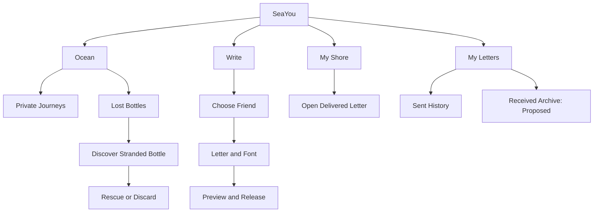
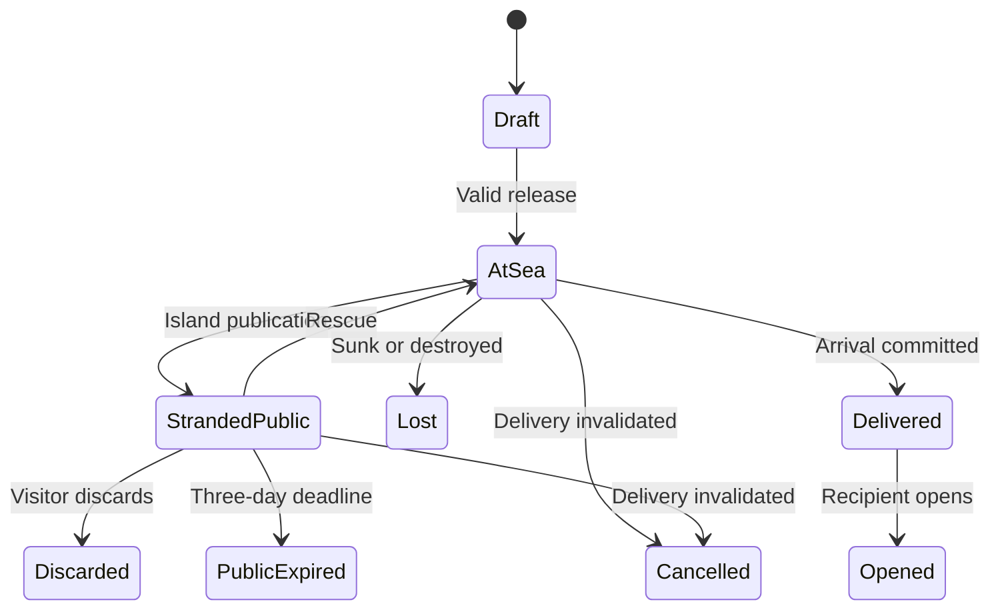
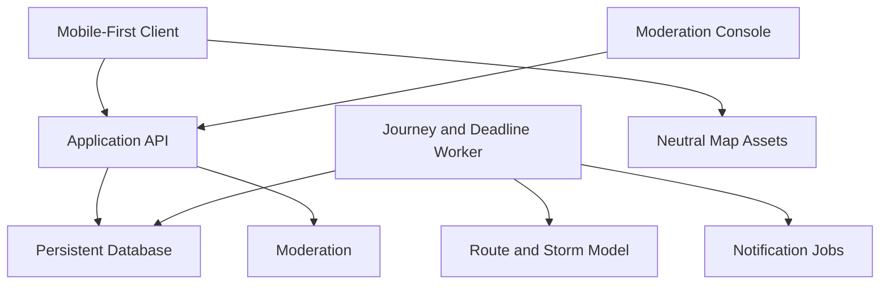

# SeaYou

## Product Specification — v1.0

Date: 22 September 2026  
Status: Describes the system as built, except where noted. **Known drift (audit QA-025, 2026-09-23):** §11 "As built" and §18 were reconciled with the code; the vision (§1), §9 intro and event table, §10.1–10.3, §11 invariants and §19–§21 still carry earlier wording about stranding, rescue and discard, which the product does not have. Where they disagree, §11 "As built", §18 and the code win.  
Supersedes: v0.2 revised product baseline  
Product name: SeaYou

## 1. Vision and decision authority

Write to someone you know. Seal the letter in a bottle, throw it into the ocean, and watch its uncertain journey toward their shore.

SeaYou is a slow correspondence experience between friends. The sender chooses the recipient; the sea determines whether the bottle arrives safely, becomes stranded and publicly discoverable, or is permanently lost. The recipient does not see the incoming journey before arrival. Anticipation, surprise, aging paper, and the possibility of rescue are the experience—not obstacles to an instant chat.

### How to read this document

This revision describes what SeaYou does, not what it might do. Earlier versions of this
document mixed confirmed rules with proposals; that distinction has been collapsed, because the
system is built:

- **Unmarked text is implemented**, and there is a test for it.
- **Open:** a choice still to be made. These are few, and each says what is missing.

Where this document and the code disagree, the code is right and this document is a bug.

## 2. Confirmed product baseline

| Area | Confirmed direction |
| --- | --- |
| Recipient | Sender chooses a friend; no self-delivery. |
| Repeat correspondence | Multiple bottles may be sent to the same recipient, subject to shore capacity. |
| Blocking | A recipient must not receive bottles from a sender they blocked. |
| Shore | Manual selection or optional GPS-assisted coastal assignment; inland users can participate. |
| Geography | No countries marked on the map; use a nonpolitical geographic presentation. |
| Route | Predefined connected sea routes, with a dashed route toward the destination. |
| Tracking | Sender sees current simulated bottle position and elapsed time since release. |
| Surprise | Recipient does not see an incoming bottle before arrival. |
| Private map | Sender sees their outgoing bottles, without user-location markers. |
| Public map | Island-stranded bottles become discoverable; others can read, rescue, or discard them. |
| Public duration | A bottle disappears from the public space after three days. Its subsequent fate remains open. |
| Risk | Storms can increase stranding risk; bottles can sink or be destroyed. |
| Failure feedback | Sender receives journey-event notifications and distinct stranded/lost markers. |
| Text | Maximum 1,000 characters; content cannot change after release. |
| Typography | Visual fonts only; no AI, rewriting, or modification of wording. |
| Readability | Sender and recipient can switch the same text to readable print. |
| Aging | Paper becomes yellowed and slightly torn during travel. |
| Unopened letters | Notify the sender after a configurable unread interval. |
| Successful opening | Ends the journey; no recipient keep-versus-rerelease decision. |
| Metadata | Release date, origin shore, sender, and recipient accompany the private bottle record. |

## 3. Audience and experience principles

Audience hypothesis: people who enjoy meaningful, playful correspondence with friends and occasional discovery of stranded letters. SeaYou applies no age restriction and is not marketed as a children's app; safeguarding requirements are reviewed before launch.

| Principle | Consequence |
| --- | --- |
| Destination is personal | A specific friend is selected before release. |
| Arrival is uncertain | Do not promise guaranteed delivery or suitability for urgent communication. |
| The journey is visible | Show coherent sea movement, elapsed time, weather, and milestones. |
| Arrival is a surprise | No incoming-route data or prearrival alerts for the recipient. |
| Exposure is explicit | Explain that stranded letters may become readable by strangers. |
| Words remain authentic | Fonts and aging affect presentation only. |
| Geography is virtual | A shore is an app anchor, not evidence of residence or physical travel. |
| Accessibility is essential | Readable print, text status, list views, and reduced motion remain available. |

Proposed: avoid streak penalties, leaderboards, fake human activity, and pay-to-bypass safety rules.

## 4. Feature and navigation map

Proposed mobile navigation: Ocean, Write, My Shore, and My Letters. Ocean contains clearly separated Private Journeys and Lost Bottles modes. Friends, notifications, and settings are secondary destinations.

Settings include shore selection, language, font accessibility, sound, reduced motion, notifications, blocked users, and account deletion. A friends area handles discovery and requests; the exact identity lookup mechanism remains open.

## 5. End-to-end user journeys

### 5.1 Sending to a friend

1. Sign in and confirm a virtual shore.
2. Select a recipient from the friends list.
3. Write up to 1,000 characters and choose a visual font.
4. Preview the letter, sender/recipient labels, and proposed sea route.
5. Acknowledge that the letter may be publicly discovered, discarded, or lost; do not include sensitive or urgent information.
6. Confirm release. The server checks friendship eligibility, blocking, capacity, route availability, and content restrictions.
7. After successful commitment, the bottle launches and appears on the sender's private map.
8. The sender follows its route and receives event notifications. The recipient sees nothing before arrival.

### 5.2 Receiving

1. The server commits arrival at the recipient's virtual shore.
2. The bottle appears in My Shore and an arrival notification is created.
3. The recipient opens the bottle and reads the aged letter; readable print is available.
4. Opening completes the journey. There is no onward-sharing decision or appended-note feature.
5. Proposed: the empty bottle is visually recycled and the letter enters a private received archive. Archive retention and the exact end animation require confirmation.

If unopened for the chosen interval, the sender receives an unread notice. This notice alone does not delete, reroute, or publish the bottle. Unopened expiration is a separate open decision.

### 5.3 Public discovery

1. A bottle strands at an island reachable from its current sea route.
2. It becomes available on the Lost Bottles map for three days, subject to safety restrictions.
3. An eligible visitor may open and read it, rescue it toward the original recipient, or discard it permanently.
4. Rescue preserves the original letter, sender, recipient, and release timestamp. Visitors cannot edit, add notes, or choose a new destination.
5. Discarding ends delivery; the sender receives a failure event.
6. At three days, public access expires even if no visitor has acted. The subsequent journey outcome is not yet approved.

## 6. Shore assignment and nonpolitical geography

### 6.1 Shore selection

Confirmed: users may choose a shore or use GPS-assisted assignment, including people living away from the sea.

Proposed implementation:

- Suggest the nearest supported coastal anchor connected to the app's maritime network, based on coordinates rather than nationality.
- Let the user confirm or override the suggestion. Without location permission, show the same manual picker.
- Calculate on-device where practical. If server processing is necessary, discard precise coordinates after resolving the shore; do not put them in analytics or logs.
- Store the virtual shore identifier, not continuous GPS location.
- Explain that assignment does not establish residence, nationality, or physical proximity to another person.

The exact meaning of “nearest” remains open. Do not encode a mandatory country-to-neighbor-country mapping. Proposed: shore changes affect future sends only; already-released bottles retain their origin and destination snapshots.

Shore catalog (decided 2026-09-14): the catalog is global. Every coastal country and inhabited coastal territory in the bundled Natural Earth 1:50m dataset has at least one selectable shore at a real, recognizable harbour or coastal town; large, island and multi-sea countries have several. Shores are verified to sit on the coast (never inland) and are attributed to the dataset geometry they lie in. Landlocked countries are served by the nearest harbours of neighbouring coastal countries: users anywhere pick any shore by hand. Caspian-only coasts and uninhabited territories are listed as explicit exclusions in the generated coverage report (`docs/SHORE_COVERAGE.md`). The six original fictional shores remain available unchanged.

### 6.2 Geographic presentation

- Show recognizable land masses, coastlines, seas, oceans, islands, and virtual shores.
- Amended 2026-09-14 (supersedes the earlier “no political borders” decision): show country borders as thin, understated lines from a bundled, offline, credential-free dataset (Natural Earth Admin 0, 1:50m, public domain, packaged by `world-atlas` under ISC) on both the Ocean map and Choose-Your-Shore. Borders are line work only, drawn beneath routes, bottle markers and shore markers.
- Do not show country or city name labels, flags, or political territory fills on the map. Apply this policy to base-map tiles, zoom levels, legends, and accessibility labels—not just custom overlays.
- Country names are intentionally hidden everywhere in the user-facing application (decided 2026-09-14): borders are visible, names are not. Shore cards, lists, search results, counts, popups and accessibility labels show only the harbour name and its sea or ocean; search matches harbour name and sea only; the client API never receives a country field. Country attribution is kept server-side for geographic validation, the coverage report and routing.
- No user-location dots or GPS tracks appear on either map.

### 6.3 Connected maritime routing

Model supported water paths as a versioned graph of shore anchors, sea waypoints, island access points, and permitted passages. Edges must connect navigable virtual water paths. A bottle cannot cross land, jump between disconnected water bodies, or strand on an unreachable island.

Only supported connected shores can be selected. If no route exists, block release with a clear explanation; never fabricate a direct line. Decide explicitly which canals or passages are included.

Decided 2026-09-19 (supersedes the earlier local-loop/minimum-duration requirement): **two users at the same harbour deliver immediately.** When the sender's and the recipient's shore are the same harbour, release delivers the bottle at once to the recipient's My Shore through the ordinary arrival transaction — the shore bottle and badge, the sender's arrived notification, the recipient's incoming notification and the standard opening and history. There is no sea journey, no storm exposure, no special reminder and no separate opening rule; release and arrival are idempotent under retries and refreshes. No notification about whether the recipient has opened the letter is sent; that reminder was considered and rejected.

Decided 2026-09-14: the maritime network is a reusable world graph (version 2) generated offline from the bundled land data — a 1° water grid whose passages are checked against a land mask, plus authored straits and canals (Gibraltar, the Turkish straits, Messina, the Danish straits, Suez, Panama, Bab-el-Mandeb, Hormuz, Singapore, Sunda, Lombok, Torres, Tsugaru, Magellan, Bering, Kerch and several harbour inlets) and connectors from every shore. The Caspian Sea and lakes are excluded. Graph version 1 and every existing route snapshot are kept unchanged; bottles released on an earlier version keep their path and arrival time.

The sender sees a dashed planned route to the chosen destination and a visually distinct completed trail. Storm deviations and rescues may produce a revised connected plan. Keep prior route versions in history. Handle date-line crossings and map wrapping correctly.

Travel is a simulation, not a claim of live current prediction. The duration model, speed, and minimum/maximum times remain open; v0.1's 1–7-day proposal is not a confirmed rule.

## 7. Map visibility and authorization

“Real time” means the current server-derived simulated position, not a physical bottle or user location. Display elapsed time from initial release, including stranding; proposed: freeze total duration at a terminal outcome. Show the last synchronization time while offline rather than presenting stale state as live.

| Viewer | Private journey before arrival | Delivered letter | Stranded public bottle |
| --- | --- | --- | --- |
| Sender | Own route, position, elapsed time, events | Own sent record; read receipt is open | Noninteractive private marker stating transfer to public map |
| Intended recipient | No route, bottle record, or incoming notification | May open after committed arrival | Proposed: exclude discovery access before arrival to preserve surprise |
| Unrelated eligible visitor | No access | No access | May read, rescue, or discard while publication is active |
| Authorized moderator | Audited access for safety cases | Audited access for safety cases | Review and restrict access |

Proposed public projection: show text, origin shore, release date, and age; omit recipient identity, destination shore, private route, and internal account identifiers. Sender attribution is open; use anonymous attribution until approved. User-entered names or identifying text inside the letter can still reveal people—hiding metadata does not make the content anonymous.

The sender's stranded marker remains nonclickable as requested. Whether the sender may independently find and rescue their own bottle through the public map is open. Proposed: exclude both original participants from public interactions; otherwise the sender can trivially undo stranding and the recipient may discover a supposedly hidden incoming letter.

Public access does not grant future tracking rights after rescue. Enforce visibility on the server and in notifications, search, caches, and historical endpoints. Knowing a bottle ID is not authorization.

## 8. Friends, blocking, and shore capacity

### 8.1 Friendship

Confirmed: correspondence uses a friends list and supports repeated bottles between the same two people. No language-based random matching, unique-recipient rule, or one-new-bottle-per-day product limit remains.

Proposed: mutual friend-request approval, exact username or invitation-link discovery, request rate limits, and no exposure of phone numbers or email addresses. Interface language may be configured independently of the language of a friend's letter.

### 8.2 Blocking and eligibility changes

Check eligibility at release, rescue, and arrival. A blocked sender must never bypass the block through a stranded bottle or public lookup.

**Unblock — decided (product decision 10):** Settings → Blocked users lists only the blocks a person placed; Unblock asks for confirmation. It permits future interaction and public-ocean encounters, restores no removed, cancelled or hidden letter, restores no friendship (a new request is needed) and reveals nothing about the blocked period. A finder may block the anonymous writer during the one reading; that entry names the bottle, never the writer, and is undone by the bottle.

**Suspended and banned accounts — decided (product decision 14):** hidden from friend lists and recipient choice (friendships kept); no incoming or outgoing bottles; bottles travelling to them are cancelled once with capacity released and the sender told only “Delivery unavailable”; no arrival notice reaches them. Bottles they sent that are still travelling when the restriction begins are cancelled the same way (their recipients are told nothing), and their adrift bottles still listed unopened leave the public ocean; storm midpoints and arrivals already due are settled first, and letters already delivered or opened stay as they are. Nothing is restored when a suspension ends or an appeal is accepted (amended 2026-09-26, audit ARCH-R-002). A locked standing screen (reason, end time, countdown, ban warning) permits only standing, a timely appeal, Support, deletion and sign-out, and the account restores itself when the suspension ends. A ban shows the same shell with no countdown and no inbox.

Proposed: if blocking or account restrictions invalidate an in-flight delivery, cancel it with a generic “Delivery unavailable” status. Do not notify the sender that they were blocked and do not publish the bottle as a fallback. Remove any active public listing. Exact behavior for unfriending alone, account deletion, and already-delivered unread letters requires confirmation. Safety restrictions take precedence over the journey fiction.

### 8.3 Capacity

Confirmed: the destination shore must have space; multiple bottles from the same sender are permitted.

Proposed reservation model:

- Reserve one destination slot atomically with release.
- Retain it during travel and stranding, including rescue; rescue must not allocate a second slot.
- A delivered unopened bottle still occupies its slot.
- Release the slot exactly once on opening or a terminal failure/cancellation.
- Reducing capacity does not evict accepted bottles; new releases wait until capacity is available.
- On full capacity, reject the new release and preserve the draft. Do not create an undisclosed delivery queue.

**Decided (product decision 8):** each account's shore holds **100** concurrent bottles — travelling to it plus delivered and unread (`MIB_SHORE_CAPACITY`). The reservation is atomic with release and transactional under concurrency. A full shore refuses the release without creating a journey; the draft is kept and the sender sees only “This friend's shore is full right now. Your letter is kept as a draft; try again later.” The owner is notified once per full episode, and again only after the shore drops below 100 and fills again. A slot is released exactly once on opening, cancellation, loss, moderation withdrawal or any other terminal state. There is no hidden queue and no sender-specific limit; technical anti-spam rate limits remain separate.

## 9. Storms, loss, and public expiry

The sea is normally calm. Storms have a defined region and time interval. Exposure can raise the probability of island stranding; sinking or destruction are supported permanent failures. Exact probabilities, whether loss can occur in calm water, and how storms alter speed remain open.

Proposed: use simulated weather for the first release, clearly labeled as part of the app. Do not imply real meteorological alerts or live ocean-current integration. Prefer rare permanent losses, but do not silently remove them from scope.

The server records each resolved exposure and outcome so refreshing the app or retrying a job cannot reroll fate. Exposure must be time-based, not dependent on how often a client polls. Storms stop affecting a bottle after arrival or terminal failure. Rescue resumes from the island, never from an arbitrary ocean position.

### 9.1 Two separate things: cosmetic weather and the hazard engine (added 2026-09-16)

The weather that ships today is **presentation only**. It is deliberately not the hazard model described above, and the two must not be conflated in code, copy or review.

| | Simulated cosmetic weather (implemented) | Hazard engine (not implemented) |
| --- | --- | --- |
| What it does | Changes what the Ocean map, the sea view and the My Shore scene draw: palette, a per-bottle storm glyph and chip, waves, rain, foam, wetness | Would change journey outcomes: stranding, sinking, destruction, drift, rescue |
| Effect on a journey | **None.** It never alters a route, a duration, an arrival time, a progress value, a capacity or a risk | Would alter state and timing |
| Where it lives | Client presentation over a deterministic, versioned schedule (`packages/shared/src/weather.ts`); a bottle's own storms come from the server (§9.3) | Server-owned weather records and resolved exposure events |
| Persistence | None needed: the schedule is reproducible from the bottle or user id, the schedule version and the time window | Persisted events, so fate is never rerolled |
| Copy rule | Weather is always labelled *simulated* and stated in words; it may never claim to delay or endanger a bottle | Would carry real consequences and must say so |

Until the numerical probabilities in this section are approved, no sinking, drift, public-claim or other destructive transition may be driven by weather. The presentation layer is built so the schedule can move behind a server endpoint without changing any displayed value.

Amended 2026-09-19 (§9.3): the probabilities are approved, and a bottle's own storms are now scheduled by the server and sent to the client, so the storm drawn on a bottle is exactly the window in which its fate can be decided. Everything else in this table still holds — the palette, the sea and the shore remain presentation, and My Shore weather is cosmetic and independent.

Superseded by risk policy v4 (§9.3): the storm is the **account's**, one on the map, rolled and persisted by the server on the account's authoritative map clock, and My Shore shows the same weather. The palette, the sea view and the shore scene remain presentation; the storm itself is the window in which each bottle's fate is decided at its midpoint. The per-bottle and per-user cosmetic schedules in `weather.ts` no longer drive anything shown.

**Weather is per bottle.** On the Ocean map a storm belongs to one bottle, not to a region: two bottles on the same route may be in different weather, the map draws no storm areas, fog patches or map-wide rain, and a storm-affected bottle is marked only by a small glyph above its own marker and an `In a storm` chip on its card. The card's `View at sea` action — never a marker tap — opens a dedicated real-time view of that bottle on open water, which shows the same weather state and can neither change it nor anything about the journey. The view never exposes letter content and is offered only while the bottle is at sea.

### 9.2 First real outcomes: adrift and sunk (added 2026-09-18)

Two terminal outcomes are implemented end to end — **adrift** (the bottle is swept off its route and drifts in the public ocean at the position where its delivery ended) and **sunk** (it goes down there; private to the sender, marked with a red X until seen and acknowledged). Both are server-owned, persisted once with their position and time, release the destination slot exactly once, end the delivery (a lost journey can never arrive or notify the recipient), and stay in the sender's Letters → Lost with the letter and passport. The public ocean shows adrift bottles to any signed-in user through a strict projection: no letter, sender, recipient, destination or route; the sender alone sees a pennant on their own bottle.

**Opening a bottle found adrift (added 2026-09-19).** Any signed-in user who is not the sender may open one bottle they find, after the card has told them that opening removes it from the public map. The opening is a single server-owned, atomic action: it grants that account access to the letter and withdraws the bottle from the public map for everyone, with the bottle id as the primary key of the opening record so exactly one of two simultaneous attempts wins; the loser is told it is no longer adrift and is shown nothing of its content. It is idempotent for the finder. The letter is never exposed by the public map API or its information card — only by the opening itself. A found letter is kept in the finder's own received archive and carries **no sender, origin shore or destination**: sender attribution in public discovery is still open (D03). The journey outcome does not change: the bottle remains lost, the sender keeps their letter, passport and Lost entry and may read their own letter at any time without claiming it, and the intended recipient is never delivered to afterwards. Rescue, re-release, further travel and transfer of ownership remain out of scope.

**One-time reading by the finder (amended 2026-09-19, replaces the finder archive above).** The sender's lost letter appears only in the sender's own Letters → Lost. A finder is told before acting that opening removes the bottle from the public map and that the letter cannot be reopened once closed; opening then atomically withdraws the bottle and opens the letter for one reading. The letter is never added to the finder's Received list or any permanent archive. The letter is served once, in the opening response, and never again: there is no resumable window, and a refresh, leaving the app or reopening SeaYou does not restore it (amended 2026-09-26, manual review round 1; replaces the earlier 15-minute recovery). The reading ends only through an explicit, confirmed “Finish reading”: Close, a stray tap outside the reader and Escape ask first rather than ending it. The one-time response is not cacheable and the letter text is never kept in durable client storage. Afterwards no finder endpoint, old link or Letters page returns the letter, while the opening event stays in the journey history. The sender's access is unlimited and never claims the bottle or alters its deadline. An opened bottle never reaches the intended recipient. Openings recorded before this rule keep their history but grant no further reads. This is an in-app rule; it makes no claim about screenshots.

### 9.3 Automatic storm outcomes — risk policy version 4 (final, supersedes v1–v3)

D08 is resolved. The policy is server-owned and versioned; every journey is stamped at release with the version it sails under, and journeys released before any policy existed carry no version and are never at risk.

**One authoritative map clock.** Each account has one IANA time zone that sets both the day/night state of its map and storm eligibility. The app detects the device's zone (never GPS, never coordinates) and reports it after sign-in, when SeaYou starts, when it returns to the foreground and when the detected zone changes. The server validates it before storing it; the most recently accepted valid device zone is authoritative for the account, and every active session of the account draws the server's stored value, so the displayed map and the server's storm state cannot disagree. Before any valid device zone has been reported the harbour's zone is used, and UTC only if no harbour zone can be derived. A legitimate change updates the map's day/night state as soon as the server accepts it.

| Rule | Value (policy v4) |
| --- | --- |
| Day and night | 07:00–19:00 is day, otherwise night, in the account's authoritative zone |
| Daytime | no storm is active and no storm-risk event is scheduled |
| Roll | when the map enters a night — at dusk, or when an accepted zone change turns a daytime map to night — a deterministic 25 % chance that the night holds a storm; persisted, and consumed whether the result is calm or storm |
| Rolling 24 hours | at most one roll per account in any 24 hours; a night entered sooner gets no roll (it is calm). A local date boundary, a zone change, closing or reopening SeaYou, or a worker restart never creates another. The four-changes-a-day limit on zone changes stays |
| Storm | one per account, 40–100 minutes, start and end both inside the same displayed night, shown only while the map is at night; one storm on the map, not one per bottle |
| Risk decision | at the storm's midpoint, one independent decision for each eligible travelling bottle of the account |
| Eligibility (per bottle) | still at sea and not due ashore by the midpoint; progress below the internal protection threshold (80 %); within the first five eligible decisions of its journey |
| Loss chance | 1 % per eligible decision |
| Cap | at most five risky decisions per journey — about 4.9 % per journey |
| Outcome on loss | 75 % adrift (public ocean), 25 % sunk |
| Same harbour | no exposure — the journey never sails |

**Time-zone changes.** A change affects future map state and future storm eligibility only. It never changes a journey's release time, route, duration or planned arrival, a risk decision or outcome that already occurred, notification timestamps, moderation or appeal deadlines, or rate-limit windows, and it never creates another weather roll. If a change turns the map to daytime while a storm is active and its midpoint decision has not happened yet, the storm stops being shown, the pending decision is cancelled, and the roll stays consumed with no replacement inside the same 24 hours. If the midpoint decision already happened, it and its outcome stand unchanged; a midpoint that has passed on server time is always decided under the clock it happened in, even if the zone changes a moment later.

**Determinism and persistence.** The roll, its result and the storm's start and end are persisted when first computed and are functions of the account, the moment the map entered the night and the policy version, so refreshing, polling, closing or reopening SeaYou, or restarting a worker never rerolls them. The storm exists on server time even while SeaYou is closed; a worker that was offline catches up the same rolls and decisions. Each bottle's draws depend only on the bottle and the storm, so one bottle's result never alters another's. Several bottles in one storm are decided in one atomic, retry-safe commit, and a retry never duplicates a decision. A loss commits through the same transactional service as before: arrival and loss can never both commit, the destination slot is released once and the sender receives the loss notification exactly once. The protection threshold is internal and never appears in user-facing copy. If the sea viewer is open when an outcome commits, it reconciles to the saved state. My Shore shows the same account weather as the map.

**Earlier versions.** v1 counted nights in a server zone, v2 at a bottle's own meridian, v3 gave every bottle its own storm on its sender's nights. Their recorded decisions and outcomes are kept exactly as they are and no history is deleted. From v4's activation, journeys still at sea from those versions are decided only by the account's storms (their earlier eligible decisions count toward the five), so no old-schedule decision can happen under a calm or daytime map; a v3 decision that had not been taken by activation is never taken. All newly released journeys use v4.

**Public expiry (resolves D02).** An adrift bottle is listed for exactly 72 hours from its persisted loss time; the server is the source of truth and sender reads do not extend it. The first eligible non-sender may open it before the deadline; at the deadline an unopened bottle is permanently removed from the public map, never resumes and is never delivered. The sender keeps letter and passport in Lost, whose action reads *Removed from the public map after 72 hours*, and receives one notification with a clock icon: *72 hours passed and the bottle you sent to [recipient] was not opened. It was removed from the public map.* Listing and opening enforce the deadline even if no worker runs; at the exact deadline opening is no longer possible, and opening and expiry are atomic against each other. Adrift bottles listed before this rule were given 72 hours from its activation.

**Time of day.** The Ocean map renders a daylight palette between 07:00 and 19:00 and the approved night palette otherwise, using the local hour in the account's authoritative IANA zone (above) — never GPS and never coordinates. The same clock drives the storm and its display. Authentication is explicitly excluded: sessions, session expiry, password-reset tokens and rate limiting run on real wall-clock time, so a development clock that advances journeys can never sign a user out.

| Event | Sender feedback | Map consequence |
| --- | --- | --- |
| Storm exposure | Storm-risk alert | Weather overlay and text/icon status |
| Stranding | Notice that bottle moved to public map | Noninteractive stranded marker |
| Rescue | Notice that journey resumed | Active bottle and revised route |
| Visitor discard | Notice of ended journey | Terminal discard marker |
| Sinking/destruction | Notice of permanent loss | Red/X-style marker plus accessible text |
| Public expiry | Status event; exact copy depends on fate decision | Public listing removed |

### Three-day public window

Confirmed: the bottle disappears from the public map after three days. Proposed clock: 72 hours from publication, unaffected by reads. Validate deadline server-side on every read and action; do not depend on a cleanup job running on time.

Decided 2026-09-19 (§9.3): expiry is permanent — the bottle never resumes and is never delivered. Rescue, discard and repeated stranding remain out of scope.

Public read access must end after rescue, discard, expiry, cancellation, or moderation restriction. This cannot retract screenshots or copies already made. Proposed: authenticated eligible visitors only, no public search-engine indexing, no retained copy for visitors. Concurrent visitors may read while available; only one valid rescue or discard can commit. Whether reading should temporarily reserve a bottle is open.

**Device time zone — decided (product decision 9, final):** the device's validated IANA zone, once accepted by the server, becomes the account's authoritative map clock for both day/night and storm eligibility (§9.3, risk policy v4). A change affects future map state and future storm eligibility only; it never changes duration, ETA, arrival, a decision already made, suspension, appeal, retention or rate limits, never rerolls weather within the rolling 24 hours, and changing the clock never speeds up, delays or rerolls a journey.

## 10. Letters, typography, aging, and metadata

### 10.1 Content and fonts

- Maximum letter length: 1,000 characters. Proposed technical definition: user-perceived Unicode characters, with matching client/server counting and a separate safe byte limit.
- Offer visual font choices such as handwriting, calligraphy, typewriter, and printed text.
- No AI generation, rewriting, translation, tone conversion, or Shakespearean wording transformation is included.
- Preview the actual wording in the selected font before sending.
- After release, the stored wording is immutable, including after rescue. No visitor or recipient may append a note.
- Proposed: lock the selected original font and sender/recipient metadata snapshots at release as well.
- Sender and recipient may toggle Readable Print without altering stored text or original appearance. Proposed: make it available to public readers too.
- Support line breaks, text selection where appropriate, screen readers, scalable text, RTL layout, and a fallback font for unsupported scripts. Review font licenses before distribution.

Safety removal/redaction is distinct from user editing: immutability must not prevent content withdrawal or moderation.

**Direction controls — decided (product decision 11):** a letter containing the invisible direction-control characters U+202A–U+202E or U+2066–U+2069 is refused (not stripped) with a clear message, on the client and authoritatively on the server. Hebrew, Arabic, English, emoji (including joiners), LRM/RLM/ALM, ZWNJ and punctuation are unaffected. Moderation views still reveal any controls in stored letters.

**Finder — decided (product decision 12, amended 2026-09-26):** one reading, once — no resumable period; never added to Received, archive or history; no friendship or access to the writer; reporting and blocking stay available while the reading is open; finishing it is explicit and confirmed.

### 10.2 Visual aging

Confirmed: paper ages during travel and arrives somewhat yellowed and torn. Proposed: derive appearance from elapsed time, storm exposure, stranding, and rescue history. Store reproducible visual parameters; never randomly change the paper every time it opens.

Yellowing, wrinkles, stains, and edge tears are decorative layers. They must not erase letters, obscure content, or reduce contrast beyond readability. Readable Print provides a clean, accessible presentation of exactly the same text. Proposed: freeze the delivered appearance at arrival.

### 10.3 Private bottle passport

| Field | Meaning |
| --- | --- |
| Sender and recipient | Display names or pseudonyms; never imply verified legal identity |
| Release date/time | Original release timestamp, retained across rescues |
| Origin shore | Shore-name snapshot at release |
| Destination shore | Planned arrival anchor; private metadata |
| Elapsed duration | Time since original release; distinguish live and completed totals |
| Status | Traveling, storm-exposed, stranded, delivered, opened, or terminal outcome |
| Journey history | Route versions, storm events, stranding, rescue, arrival, failure |

Whether the recipient sees the completed route after arrival is open. The public projection is deliberately more limited than this private passport.

## 11. Lifecycle and concurrency model

The following model separates journey state from weather, moderation, and archive placement. This avoids treating a storm alert or a visual animation as an independent delivery state.

**As built (amended 2026-09-23).** The server writes five journey states (`packages/shared/src/bottle-state.ts`): `at_sea` → `delivered` → `opened`; `at_sea` → `lost`, with loss reason `adrift` (listed on the public map for 72 hours from the loss, with a one-time reading for its single finder, then permanently removed — §9.2–9.3) or `sunk` (private to the sender); and `at_sea` → `cancelled` (a block or an inactive recipient at arrival, or an account deletion). `opened`, `lost` and `cancelled` are terminal. Drafts are kept on the client, not as a server state. The diagram and table below are the earlier design and are kept for history: StrandedPublic, Rescue, Discarded and PublicExpired do not exist — public expiry is recorded on a lost bottle, not as a state.

PublicExpired has no approved onward transition yet. Storm Risk is an exposure flag on AtSea; Rescued is an event transitioning back to AtSea; Completed is the journey outcome at opening, not a user choice. Archived is a proposed private storage/view property. Lost includes a reason distinguishing sinking and destruction.

| State | Allowed action | Deadline/terminal behavior |
| --- | --- | --- |
| Draft | Edit, preview, release | No live journey |
| AtSea | Sender follows; server advances | May arrive, strand, fail, or cancel |
| StrandedPublic | Eligible visitors read/rescue/discard | Public access ends at three-day deadline |
| PublicExpired | No public interaction | Fate must be resolved before implementation |
| Delivered | Intended recipient opens | Unread notice does not itself change state |
| Opened | Read again only if archive approved | Travel complete; no rerelease |
| Discarded/Lost/Cancelled | History only as permitted | No future delivery or rescue |

Moderation is an independent restriction: Clear, Quarantined, or Removed. Quarantine immediately denies reads and journey actions. Clearing must restore a compatible prior state, never resurrect a terminal bottle or reopen an expired publication. Proposed: public expiry uses wall-clock time even under quarantine; travel-time treatment during review remains open. Reports create cases, not automatic punishment from a single report.

Proposed reliability invariants:

1. Release commits the immutable letter, chosen recipient, route, capacity reservation, and first event together.
2. Rescue/discard/expiry compete against one state version and deadline; the first valid committed action wins.
3. Reading a public bottle does not complete delivery or produce a recipient-read receipt.
4. A block or moderation change is checked transactionally before arrival/rescue; stale UI cannot bypass it.
5. Retry keys prevent duplicate bottles, rescues, arrivals, slot releases, and notifications.
6. Terminal states cannot resume through delayed workers or old links.
7. Server time governs travel and deadlines; local device clocks cannot accelerate delivery.

## 12. Screens and required states

| Screen | Purpose | Required states |
| --- | --- | --- |
| Welcome and shore setup | Explain premise and choose anchor | Manual/GPS, permission denied, unsupported route, safety explanation |
| Friends | Select eligible recipients | Empty list, requests, pending/accepted, blocked/unavailable |
| Write and preview | Text, font, recipient, risk disclosure | Draft, 1,000-character limit, readable print, validation |
| Release scene | Seal, throw, splash | Submitting, confirmed, failed, reduced motion |
| Private Ocean | Track own sent bottles | Active route, stale/offline, storm, nonclickable stranded, terminal marker, list view |
| Lost Bottles | Public island discovery | Empty, available, expired, claimed by another action, restricted |
| Public letter | Read and decide | Readable print, rescue, destructive-discard confirmation, unavailable |
| My Shore | Delivered bottles only | Empty, sealed arrival, opened, unavailable |
| Letter reader | Read aged letter | Original font, clean print, report/block, removed-content placeholder |
| Sent history / passport | Events and result | Traveling, stranded, rescued, failed, delivered |
| Received archive | Proposed retained letters | Empty, read, locally hidden/deleted, content withdrawn |
| Notifications | Events and unread notices | Unread/read, permission off, obsolete event |
| Settings | Preferences and account | Shore, motion, sound, language, blocking, deletion |
| Moderation console | Review and enforcement | Queue, evidence, actions, audit trail, review status |

## 13. Animation and design handoff

Proposed visual direction: warm illustrated ocean, translucent glass, tactile paper, restrained motion. Final style requires visual references and approval.

| Sequence | Behavior | Proposed timing |
| --- | --- | --- |
| Calm sea | Soft waves and bottle bobbing | Low-intensity loop |
| Seal | Roll letter, insert, cork | 1–2 seconds |
| Throw | Arc with restrained rotation | 0.7–1.2 seconds |
| Splash | Impact, ripples, floating pose | 0.5–1 second |
| Map transition | Pull back to route | 0.8–1.5 seconds |
| Storm | Per-bottle weather indicator; today cosmetic only (§9.1) | Avoid continuous intense effects; no flashes or strobing, nothing above 0.2 Hz; distant lightning in the sea view is a slow glow, off under reduced motion |
| Stranding | Bottle reaches island, status changes | Brief transition |
| Rescue | Bottle returns from island to sea | Brief confirmed transition |
| Loss/discard | Distinct failure outcome | Skippable; persistent text marker |
| Arrival/opening | Cork opens, aged letter revealed | 2–3 seconds, skippable |
| Completion | Proposed empty-bottle recycling | Must not imply letter deletion if archived |

A visible release button always works; swipe-to-throw is optional. Never show successful release/rescue before server confirmation. Failure preserves the draft or current state. Opening animation must not block access to an already available letter.

Reduced motion uses short fades and immediate status changes. Sound is optional. Do not communicate loss only through red color or audio. Pause decorative loops while backgrounded and validate on mid-range phones.

Claude Design should provide screen layouts, storyboards, assets/layers, anchors, timing, easing, responsive rules, aging variants, and reduced-motion/failure states. Claude Code is intended to implement approved designs later. A mockup is not presumed to be an exportable production animation. Select animation technology only after an approved prototype.

## 14. Notifications

| Trigger | Audience | Rule |
| --- | --- | --- |
| Storm exposure | Sender | Deduplicated relevant alert, not repeated every tick |
| Stranding/publication | Sender | Explain public-map transfer and deadline |
| Rescue | Sender | Explain resumed journey; rescuer attribution open |
| Discard/loss | Sender | Clearly state terminal failure |
| Public expiry | Sender | One deduplicated notice with a clock icon: *72 hours passed and the bottle you sent to [recipient] was not opened. It was removed from the public map.* (decided 2026-09-19) |
| Arrival | Recipient | Only after server commits delivery |
| Unopened interval | Sender | Recheck unopened status at dispatch |
| Arrival/read receipt | Sender | Arrival: the existing *reached its destination* notice. A notification about whether the recipient opened the letter was considered and rejected (2026-09-19). |
| Delivery invalidated | Sender | Generic message; do not expose a block |

**Lifetime (product decision 6):** user-visible notifications are never deleted automatically. Each keeps its type, related item, time and read state; marking read only clears the badge, and the history is paginated. Operational data — delivery attempts, retries, worker state, provider errors — may be pruned after 90 days. Cleanup never deletes letters or journeys. A full shore produces one `shore_full` notice per episode.

In-app events are required. Push delivery depends on platform and permission; the journey works without push permission. Hide letter excerpts on lock screens by default. Notification failure never rolls back arrival. Use event IDs, retry limits, and stale-event checks; notifications must not leak hidden incoming journeys.

## 15. MVP scope

### Required revised core

Accounts; virtual shores; friends-based recipient selection; optional GPS assistance; politically neutral private map; connected dashed routes; simulated time-based movement; visual fonts; readable print; aging paper; release/opening animations; actual storm/stranding/loss outcomes; public island discovery with reading, rescue, and discard; three-day public expiry; delivered shore capacity; unread notice; sender history; reporting/blocking; server-side access and concurrency protection.

Safety controls and accessibility are part of the baseline, not optional polish. Public discovery and permanent loss are no longer deferred merely because v0.1 excluded them.

### Proposed supporting scope

Mutual friend approval, capacity reservation at send time, a private received archive, recipient metadata hiding in public, authenticated public discovery, simulated regional weather, and deletion/moderation workflows as described above. Resolve the listed policy choices before implementing their dependent behavior.

### Excluded or deferred

AI writing or rewriting; automatic translation; random-recipient delivery; appended-note chains; recipient rerelease after successful arrival; photos/voice notes; instant direct chat; live scientific current integration; physical-location requirements; phone booths; cosmetic purchases and payment mechanics. No monetary delivery guarantees are specified.

The full requested core is broader than a minimal sending prototype. Stage implementation internally, but do not silently remove approved capabilities from the target product.

## 16. Privacy, safety, and moderation

Directed correspondence with conditional public exposure must not be advertised as reliably confidential private messaging.

- Show an explicit pre-send warning: a stranded letter may be read by strangers, discarded, or lost. Do not include personal details, sensitive information, important records, or urgent messages.
- Proposed: require affirmative acknowledgment and retain the disclosure version with release.
- Metadata hiding cannot remove names or personal information typed into the body. Offer pre-send guidance and content review; do not claim guaranteed anonymization.
- Restrict public listing fields, server responses, previews, caching, and indexing consistently.
- Enforce blocks across private delivery and public discovery; never use publication to circumvent a block.
- Provide report/block controls on delivered and public letters. Rate-limit friend requests, sends, public actions, and reports; address coordinated mass discarding without silently eliminating the discard feature.
- No stranger can edit the original letter. A public reader has no continuing right to the content or route after rescue.
- Support safety withdrawal and account deletion despite ordinary post-send immutability. Explain that screenshots cannot be recalled.
- Define retention for sent/received letters, public content, failed journeys, location processing, and moderation evidence before launch.
### 16.1 Documents and consent — implemented

The Terms of Use, Community Rules, Privacy Policy and Child Safety Standards are published at
version 1.1 (a material change carrying the product decisions of 2026-09), in English, readable before registration and from account settings, and served as
public unauthenticated HTML at `/legal/*` and `/support` for store-listing use. Registration
requires two separate, initially unchecked decisions — agreeing to the Terms of Use and
Community Rules, and confirming the Privacy Policy has been read — validated by the server,
which records each document's version and the acceptance time per account. A new version asks
every account again before ordinary use, while leaving authentication, the documents, standing,
the decision notice, appeals, support, sign-out and deletion reachable.

SeaYou has no age gate of any kind — no date of birth, no 18+ checkbox, no age verification and
no stored age claim — and makes no claim that its users are adults or have been age-verified.
It is not marketed as a children's app, which is a store-listing and Play Console decision
rather than a registration restriction. Safety rules concerning minors bind every user.

### 16.2 Reporting and review — implemented

A reader reports a letter from the reader itself — the recipient of a delivered letter, or an
eligible finder during the one-time reading of a public bottle — with a reason, an optional
explanation and the option to hide the letter for themselves at once. Nothing is scanned before
a report. Reports about one letter form one case holding the letter as protected evidence, and
a case yields at most one violation. Report and Block are separate actions; blocking stops
correspondence in both directions and also prevents the two accounts encountering each other
through public-ocean interactions.

A locally run model reviews each case and returns a validated accept / reject / uncertain with
its reasoning, a translation beside the original, and, when unsure, why. It sees only reported
letters and holds no database or administrative power: its verdict is a recommendation and it
never decides, sanctions or bans (`MIB_AI_AUTO_DECIDE` was removed; `true` stops the API). If it
flags a possible child-safety issue the case is marked urgent and listed first with the
recommendation, reasoning, uncertainty and translation; a case is visible to administrators
before the model answers. It has no path at all to the critical child-safety action. If
an external provider is ever used, the Privacy Policy and the store Data Safety declaration are
updated before any report content is sent to it.

### 16.3 Enforcement — implemented

Only an upheld report creates a violation: the letter is withdrawn from every in-app read while
the evidence stays with the case, and the journey's timing, outcome and public listing are
unchanged. One upheld violation warns, two suspend the account for seven elapsed days, three ban
it permanently.

**Upheld violations never expire.** Serving a suspension does not remove one from the count; the
only thing that does is an accepted appeal. Rejected and undecided reports never count.

The administrator makes one of three decisions (product decision 2): reject; uphold an ordinary
violation; or confirm a critical child-safety violation, which bans immediately, without the
ladder, and withdraws the letter. Each requires a written reason; the critical one also a strong
confirmation stating that it bans permanently and immediately, and records the administrator,
the timestamp, the classification, the reason and the action in the audit trail. Escalating an
ordinary violation that was never appealed (waived, lapsed or still open) to critical opens one
new 30-day appeal.

**Finality (product decision 1):** one administrator decides; there is no second approval and no
revoke, reopen or reverse. Only the sender's appeal changes a decision. The console shows the
consequence before every confirmation.

### 16.4 The decision notice and the single appeal — implemented

An appeal is offered when the decision is presented to the sender, and only then. The notice
offers **Appeal decision** and **Continue without appealing**; continuing asks a second time —
*If you continue, you will permanently lose the option to appeal this decision.* — with
**Go back** and **Skip appeal**.

Only confirming **Skip appeal** waives the appeal, and it is permanent. Closing, refreshing or
leaving SeaYou without choosing waives nothing: the unresolved notice returns on the next
eligible visit. Each violation may be appealed once, within **30 days of the decision** measured
on server time; afterwards the notice shows the decision and says the appeal period has
expired, with a single acknowledgement. A rejected appeal is final inside SeaYou;
an accepted appeal revokes the violation and recalculates standing immediately. Presentation,
waiver and appeal are server-authoritative, transactional, idempotent and audit logged.

A suspended or banned account keeps access to the decision, the appeal, support, account
deletion and sign-out.

### 16.5 Evidence retention — implemented and running

Reporting is bounded per account by two sliding windows counted from the stored reports
themselves — ten an hour and forty a day — with per-address windows on top. A repeat report on a
letter already reported writes nothing and costs nothing, and reading one's standing, answering
a decision notice and appealing carry no limit at all.

A case's content evidence — the copied letter, the reporters' explanations and the AI
translation and notes — is kept **30 days from the human decision** (product decision 5), the
same window as the appeal, and a timely appeal keeps it until the appeal is decided; it is
redactable at the later of the two, automatically and idempotently. An undecided report keeps its
evidence; an unopened decision notice does not extend it. Redaction clears that evidence, and
preserves the case identity and deduplication, the decision and its reason, the administrator,
the decision and appeal timestamps, the violation and enforcement count, the report relationship
needed for abuse prevention, and the account's standing history — because upheld violations do
not expire.

Evidence is kept longer only under a documented legal or child-safety hold, which records the
reason, who placed it and when; releasing it returns the case to the ordinary
calculation. There is no undocumented path to indefinite retention. The process supports a
dry-run plan and a safe apply (`retention:plan`, `-- --apply`).

For an upheld report the offending letter stays unavailable for in-app reading after redaction.
For a rejected report or an accepted appeal the original letter remains, or becomes, available
under its ordinary access rules; only the moderation evidence copy is redacted.

The reporter's identity is never disclosed to the sender through SeaYou, except where disclosure
is required by law.

### 16.6 Roles — implemented

An account holds exactly one role. `admin` reviews and decides reports and appeals and applies
documented moderation actions, and gets no DEV controls. `developer` may use the DEV simulation
panel, outside production only, and has no moderation authority: admin routes answer 403.
Registration can never select either, no request may carry one, and both are granted only by
server-side CLI against a stable account id.

### 16.7 Still open

- Review staffing and escalation for a public pilot: automated checks alone are not a complete
  safety process, and nothing in the code can supply people.
- Legal review of the published documents before a public launch.

This document specifies product expectations, not a legal compliance conclusion. Relevant launch review remains required.

## 17. Technology-neutral architecture

The server owns eligibility, canonical position/progress, deadlines, storm outcomes, publication rights, and state transitions. The client interpolates authorized positions for smooth display. Opening/refreshing the app does not drive fate or advance travel. Worker recovery catches up deterministically from persisted events after downtime.

| Entity | Responsibility |
| --- | --- |
| User | Account, display name, virtual shore, settings, status |
| Friendship / FriendRequest | Pair relationship and approval state |
| Block | Directional denial relation enforced across surfaces |
| Shore | Neutral name, supported graph anchor, availability |
| RouteGraph / RoutePlan | Versioned connected edges and bottle-specific plan |
| Bottle | Immutable sender/recipient/letter reference, state, version, timestamps |
| Letter | Text, original font, content restriction, release snapshot |
| JourneySegment | Progress, route version, timing, rescue continuity |
| JourneyEvent | Append-only milestones and recorded risk outcomes |
| Storm | Region, interval, simulation parameters and version |
| PublicListing | Island, publication time, expiry, status, atomic action result |
| CapacityReservation | One recipient slot per accepted bottle, release status |
| AgingProfile | Reproducible presentation parameters and event inputs |
| ArchiveEntry | Proposed private saved-letter visibility, not a new journey |
| Report / ModerationCase | Evidence, restriction, actions, audit trail |
| NotificationJob | Audience, event, retry/delivery state |

Use database transactions or equivalent atomic operations, optimistic state versions, idempotency keys, and an event/outbox pattern as appropriate. Minimize personal data in logs. Public DTOs must not simply serialize private bottle entities. Recheck expiry and access on every action, even if background processing is delayed.

Web/PWA versus native mobile, stack, database, map provider, hosting, and animation tooling remain open. No paid service or provider is approved here.

## 18. Acceptance criteria

Confirmed behavior and proposed safeguards to verify once the relevant decisions are approved:

Amended 2026-09-23: criteria 9, 11–15, 17 and 21 now describe the shipped outcomes (adrift, sunk, cancelled — §9.2–9.3, §11 "As built"). Rescue, discard and a chosen fate after public expiry are not part of the product. This amendment corrects wording only; it does not mark any criterion as verified.

1. Sender selects a friend; self-send is rejected and repeat sends to that friend are supported.
2. Release fails safely for invalid recipients, blocks, full capacity, unsupported routes, or rejected content; the draft remains intact.
3. Retried release creates exactly one bottle and one reservation.
4. Manual shore selection works without GPS. No user coordinates appear in any response; shore anchors and the dataset's country name are app data. Country borders render as thin lines only; country names appear nowhere in the UI or client API (amended 2026-09-14).
5. Every route and island deviation stays in the connected sea graph, including date-line and same-shore cases.
6. Sender sees dashed destination route, current simulated position, elapsed time, and all their outgoing history.
7. Recipient cannot retrieve the incoming bottle or receive prearrival alerts through any ordinary endpoint.
8. Storm resolution is consistent across clients and retries; loss remains terminal.
9. A bottle lost adrift creates one public listing and a pennant on the sender's own map, with one sender notification; a sunk bottle is private to the sender.
10. Public projection does not expose private destination or recipient fields under the proposed privacy policy.
11. Opening an adrift bottle honors eligibility (never the sender, never across a block), moderation, and the 72-hour deadline.
12. Concurrent openings and expiry cannot produce more than one winner: at most one finder opens a bottle, and never at or after its deadline.
13. Opening an adrift bottle changes nothing in the sender's record: the letter, recipient and timestamps are kept, the bottle stays lost, the intended recipient is never delivered to, and the finder cannot append notes or reopen the letter after the one-time reading.
14. After exactly 72 hours from the loss, an unopened adrift bottle is permanently removed from the public map, is never delivered, and the sender is notified once.
15. A lost (adrift or sunk) or cancelled bottle can never arrive later.
16. Changing device time or client refresh frequency cannot affect arrival or risk.
17. Opening completes the journey; there is no keep or re-release step. A finder's public reading is not recipient opening.
18. Unread notification is sent only while still unopened and does not independently cause publication or deletion.
19. Font changes never rewrite wording; Readable Print preserves text exactly, including supported RTL and Unicode content.
20. Aging never removes characters or blocks accessible reading.
21. Blocking during transit cannot be bypassed by public visibility or delayed arrival work: a block in either direction cancels the journey at arrival and hides an adrift bottle from anyone blocked by, or blocking, its sender.
22. Worker recovery, notification retries, and failure handling do not duplicate events or free capacity twice.
23. Reduced-motion and list alternatives support every essential action without sound, GPS, or push permission.
24. Restricted/withdrawn content is unavailable through old links and ordinary cached responses; terminal records remain consistent.

## 19. Pilot measures and operational strategy

Measure friend-request acceptance, first-release completion, repeat correspondence, travel duration, arrival/open rate, unread rate, capacity rejection, storm exposure, stranding, rescue, discard, permanent loss, public expiry, and moderation response time. Separate arrival success from public discovery activity; do not count a stranger reading a stranded letter as successful delivery.

Ask whether suspense feels enjoyable, losses feel acceptable, and users genuinely understand conditional public exposure. Observe abuse and coordinated discarding, not just engagement. No numerical success targets or risk rates are claimed yet.

Proposed pilot: small opt-in friend groups across several virtual shores, with clearly labeled demonstration bottles and genuine waiting periods. Keep accelerated test journeys separate. No fabricated users or international activity. Assign moderation and incident-response ownership before participants can publish real letters.

## 20. Development roadmap and gates

| Stage | Deliverable | Exit condition |
| --- | --- | --- |
| 1. Product alignment | v0.2 decisions resolved | Timing, expiry fate, visibility, platform, capacity, and completion approved |
| 2. Visual prototype | Shore, font, throw, private/public maps, aged opening | Mobile direction and accessibility approved |
| 3. Directed delivery slice | Friend selection through delivery/opening | State, route, persistence, and capacity behavior verified |
| 4. Risk and discovery | Storms, loss, island publication, rescue/discard/expiry | Concurrent actions and terminal outcomes verified |
| 5. Safety and reliability | Blocks, moderation, deletion, notifications, recovery | Acceptance criteria and access boundaries verified |
| 6. Closed pilot | Real friend groups and real waiting | Feedback informs approved tuning |
| 7. Launch preparation | Platform, support, privacy and operational readiness | Release checks complete |

This roadmap is a plan only. The current task ends with the updated specification.

## 21. Change log from v0.1

| Previous baseline | v0.2 replacement |
| --- | --- |
| Random recipient and language matching | Chosen friend with fixed destination |
| One new bottle daily | Repeat sends, bounded by capacity and approved safeguards |
| Future destination hidden from sender | Sender sees dashed destination route; recipient remains unaware |
| General world regions | Real global harbours with thin, unlabelled country borders (amended 2026-09-14; previously country-free presentation) |
| Decorative-only weather; no permanent loss | Consequential storms, stranding, sinking/destruction |
| Private shared bottle chain | Conditional public discovery only while stranded |
| Keep/release and appended notes | Recipient opening completes delivery; rescuer preserves the original letter |
| Unopened requeue and opened hold timeout | Unread notice; separate expiration/completion choices remain open |
| Plain text presentation | Visual fonts, readable print, and aging paper |
| Matching worker and assignment model | Directed routes, reservations, risk events, public listings |
| Public browsing and directed messages deferred | Both part of the revised core |
| 1–7-day initial proposal | Travel-duration model still open; not silently carried forward |

## 22. Decisions still requiring confirmation

| ID | Decision | Recommendation or clarification |
| --- | --- | --- |
| D01 | Travel speed and duration | **Decided (product decision 15):** keep the current constants (`MIB_MS_PER_CHART_UNIT`, `MIB_MIN_JOURNEY_MS`); same-harbour delivery stays immediate; device time has no effect. No retune. |
| D02 | Fate after three public days | **Decided 2026-09-19:** permanent removal after exactly 72 hours from the loss; no resumption (§9.3). |
| D03 | Public identity fields and participant access | Hide recipient/destination; propose excluding sender and recipient from discovery interactions. Decide sender attribution. |
| D04 | Completion and retention | Propose private received archive and visual recycling; user confirmed only that opening ends the journey. Decide sender copy after loss. |
| D05 | Unread timing and expiration | Set notification interval; separately decide whether unopened bottles ever expire. |
| D06 | Capacity and anti-spam | **Decided (product decision 8):** 100 concurrent bottles per shore (travelling + delivered-unread), atomic reservation, refusal without a queue, one full notice per episode (§8.3). |
| D07 | Friends and changing eligibility | Confirm mutual approval, discovery method, unfriending behavior, and in-flight cancellation policy. |
| D08 | Risk model | **Decided**, final as risk policy v4 (§9.3): one map clock per account; daytime maps have no storm; each night entered rolls a deterministic 25 % account storm at most once per rolling 24 hours; midpoint decisions per bottle with 1 % loss, five-decision cap, internal progress protection, arrival first, 75/25 adrift/sunk. Rescue risk and repeat stranding remain out of scope. |
| D09 | Shore catalog | Confirm nearest-connected-coast rule, naming, supported passages, and shore changes during transit. |
| D10 | Receipts and postarrival map | Decide sender arrival/read receipts and recipient access to completed route. |
| D11 | Public discovery mechanics | Confirm authenticated access, concurrent reading, optional reading lease, and protections against mass discard. |
| D12 | Platform and presentation | Choose web/PWA or native, initial languages, approved fonts, visual style, and font-lock behavior. |
| D13 | Launch safety and operations | Confirm audience, disclosure, moderation staffing, retention/deletion, and review-pause clock rules. |

Next revision: resolve the choices above in manageable groups, then approve the implementation-ready baseline. Do not introduce AI writing or change the user's letter content as part of typography.
